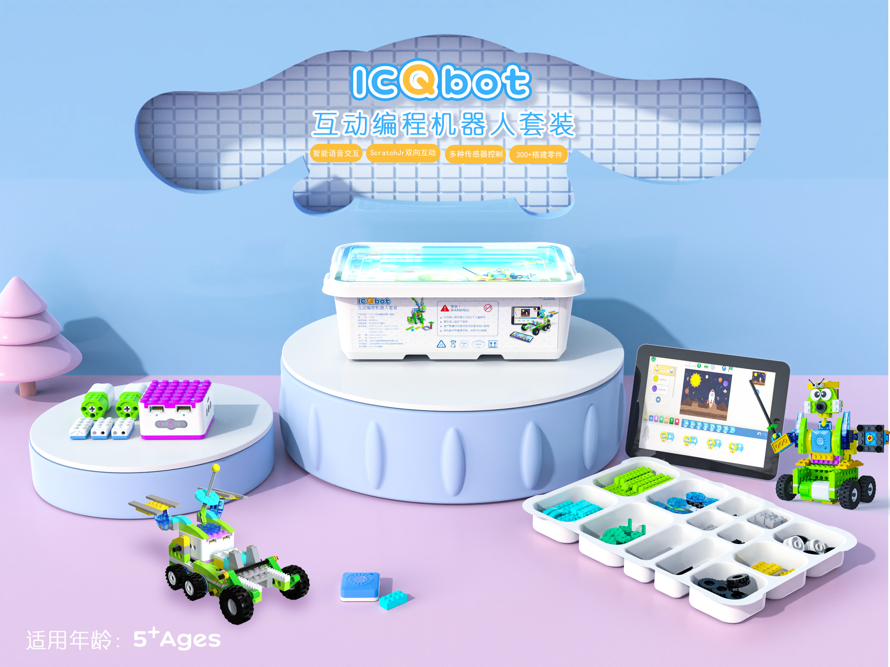

# Introduction

## Concepts

The ICQbot series is specifically designed for children aged 5-8. The power components include a main controller: Xiao Q Robot, 2 motors, 2 distance sensors, 1 tilt sensor, and 1 voice recognition sensor. The software supports ICQbot programming/offline voice programming, enabling multiple control modes such as direct button control, sensor logic control, screen-free voice coding, and software-hardware interactive programming. Combined with building blocks, the ICQbot offers diverse play options, enabling bidirectional interaction between hardware and software. It enhances children's hands-on skills and fosters programming thinking.  

## Parts List

<table style="width: 100%; text-align: center; border-collapse: collapse;">
  <tr>
    <td style="width: 33.33%; text-align: center; vertical-align: middle;">
      
    </td>
    <td style="width: 33.33%; text-align: center; vertical-align: middle;">
      
    </td>
    <td style="width: 33.33%; text-align: center; vertical-align: middle;">
      
    </td>
  </tr>
  <tr>
    <td style="color: #000000; text-align: center;">ICQbot Xiao Q Robot</td>
    <td style="color: #000000; text-align: center;">Distance Sensor</td>
    <td style="color: #000000; text-align: center;">Tilt Sensor</td>
  </tr>
  <tr>
    <td style="width: 33.33%; text-align: center; vertical-align: middle;">
      
    </td>
    <td style="width: 33.33%; text-align: center; vertical-align: middle;">
      
    </td>
    <td style="width: 33.33%; text-align: center; vertical-align: middle;">
      
    </td>
  </tr>
  <tr>
    <td style="color: #000000; text-align: center;">Voice Recognition Sensor</td>
    <td style="color: #000000; text-align: center;">Motor</td>
    <td style="color: #000000; text-align: center;">Programming Cards</td>
  </tr>
</table>

## ICQbot Series of Set
| **Item** | **ICQbot Interactive Coding Robot Set (Electronics)** |
| :---: | :---: |
| ICQbot Xiao Q Robot | 1 |
| Distance Sensor  | 2 |
| Tilt Sensor  | 1 |
| Voice Recognition Sensor  | 1 |
| Motor  | 2 |
| Programming Cards   | 1 |

