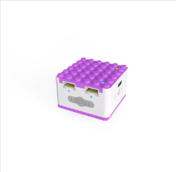
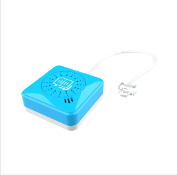
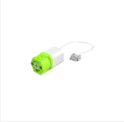

# Quick Start

If you are using this product for the first time, please read this chapter carefully to quickly learn how to use ICQbot to make some simple cases. 

## Voice Programming Control  
In this section, we will use the ICQbot Xiao Q Robot, voice recognition sensor, and motor to create a fan controlled by voice commands. Through this project, you will gain a deeper understanding of how voice commands interact with hardware modules.  

**Case Overview**

**Steps**

1. Preparation
   
|  |  |  |
| :---: | :---: | :---: |
| ICQbot Xiao Q Robot × 1 | Voice Recognition Sensor × 1 | Motor × 1 |
|  |  |  |
|  2×6 Thin Plates  × 4 |  40-Tooth Gear  × 1 |  No. 3 Axle  × 1 |

2. Assembly Steps  

|  |  |
| :--- | :--- |
| a、Plug the voice recognition sensor into blue port 1.  Plug the motor into green port 1.   | b、Assemble the fan blades and attach them to the motor.   |
|  | |
| c、 Start using the fan:   + First, wake up ICQbot by saying "Hello, Xiao Q." + Use voice commands like “Motor one forward/backward” to control the fan's rotation. + Say “Stop motion” to stop the motor. | |

## Software Programming

**Install the Software**

For Android Phone and tablet：** Click the following link to download the installation package: 👉 [[Software Installation]](https://drive.google.com/file/d/1tis60r2DEChY0mD25CEU1n2o-GDv5_sX/view?usp=drive_link)

For iPhone and iPad：Please search "ICQbot" in AppStore to install.

**Steps for Programming**

Step 1: Connect Bluetooth

Before using the programming software, ensure that location and Bluetooth permissions are enabled, and the ICQBot is powered on.

Open the ICQBot programming software, follow the video to connect. 👉 [[Video Tutorial]](https://youtu.be/Fu3GVC1s6qc)

Step 2: Program for your models

Please see the [Video Demos](https://youtube.com/playlist?list=PLscVLoYXLLuQmp8RMY7gpCIc-nSugiRy-&si=LMMQqhUOQnJaaepq) for each models, and have fun!

