# Programming Control Mode

## Case 1: Software Programming

### Xiao Q Robot Button Controls Character Movement  
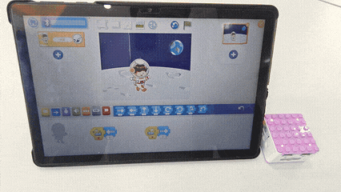

### How to use the Xiao Q Robot buttons to control the movement of a software character?  
1. Prearation

|   |  |
| :---: | :---: |
| ICQbot Xiao Q Robot × 1 |  Android Tablet ×1 / iOS Tablet ×1   |

2. Steps:  

|  | 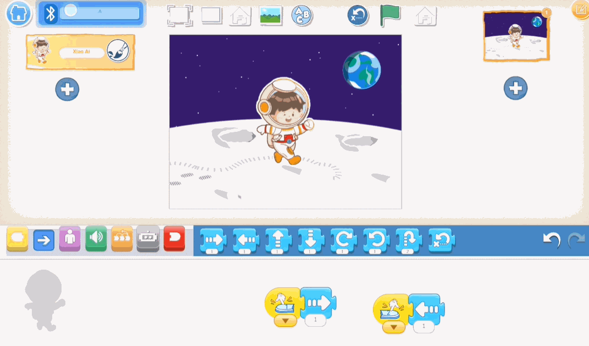 |
| --- | --- |
| 1、Press and hold the power button for 3s to power on the Xiao Q Robot.  Open the APP and connect to Bluetooth. After Bluetooth is connected,  the Xiao Q Robot will emit a “beep” sound.   | 2、In the software, select the moon background and the Xiao Ai character, then start programming.  Use the Xiao Q Robot button 1 to move the character one step to the left,  and button 2 to move the character one step to the right.   |
|  |  |
| 3、Start the program and observe the result (Xiao Q Robot button 1 controls  Xiao Ai to move left, and button 2 controls Xiao Ai to move right). | |

## Case 2: Hardware-Software Interaction
### Tilt Sensor Controls Xiao Ai Character Skiing  

### How to use the tilt sensor to control the movement of a software character?  
Steps

1. Prearation

|  | 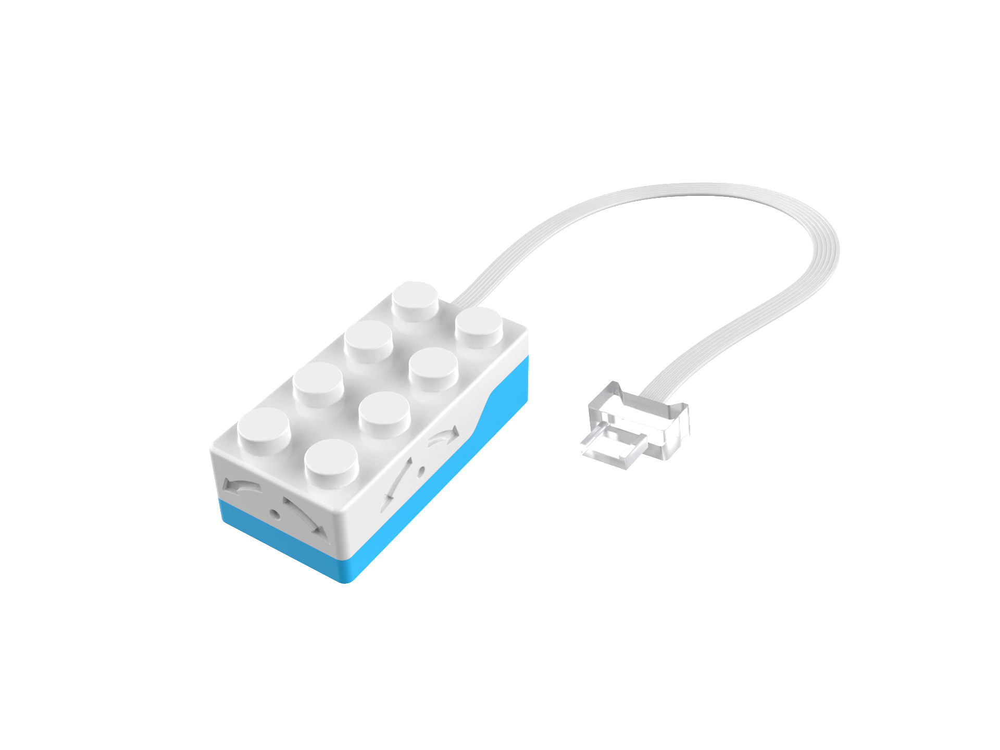 |  |
| :---: | :---: | --- |
| ICQbot Xiao Q Robot × 1 &nbsp;&nbsp;&nbsp;| Tilt Sensor×1 &nbsp;&nbsp;&nbsp;&nbsp;&nbsp;&nbsp;&nbsp;&nbsp;&nbsp;&nbsp;&nbsp;&nbsp;| Android Tablet ×1 / iOS Tablet ×1   |

2. Steps Display

|  | 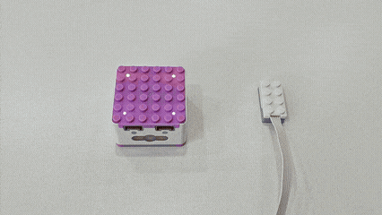 |
| --- | --- |
| 1、Press and hold the power button for 3s to power on the Xiao Q Robot. <be/>Open the APP and connect to Bluetooth.   | 2、 Connect the tilt sensor to port 1 (input port).   |
| 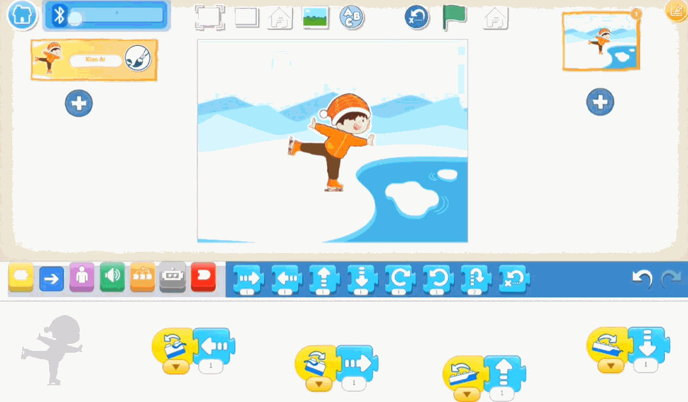 | 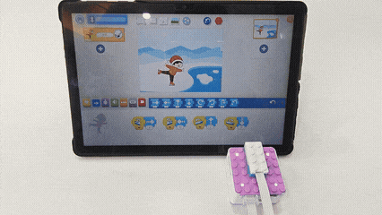 |
| 3、In the software, select the character and background,  then program the character: when the tilt sensor tilts upward,  the character moves up; when tilted downward, the character moves down;  when tilted to the left, the character moves left;  and when tilted to the right, the character moves right.   | 4、Effect display. |

## Case 3: Hardware-Software Interaction
### Programming Virtual Buttons to Control Car Movement  
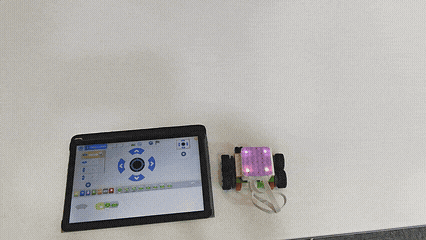

### How to create a virtual keyboard to control car movement?  
Steps

1. Prearation

|  |  |  |
| :---: | :---: | :---: |
| ICQbot Xiao Q Robot × 1 &nbsp;&nbsp;&nbsp;| Motors × 2&nbsp;&nbsp;&nbsp;&nbsp;&nbsp;&nbsp;&nbsp;&nbsp;&nbsp;&nbsp;&nbsp;&nbsp;&nbsp;&nbsp;&nbsp; | Android Tablet ×1 / iOS Tablet ×1   |

1. Structure Setup 

|  | 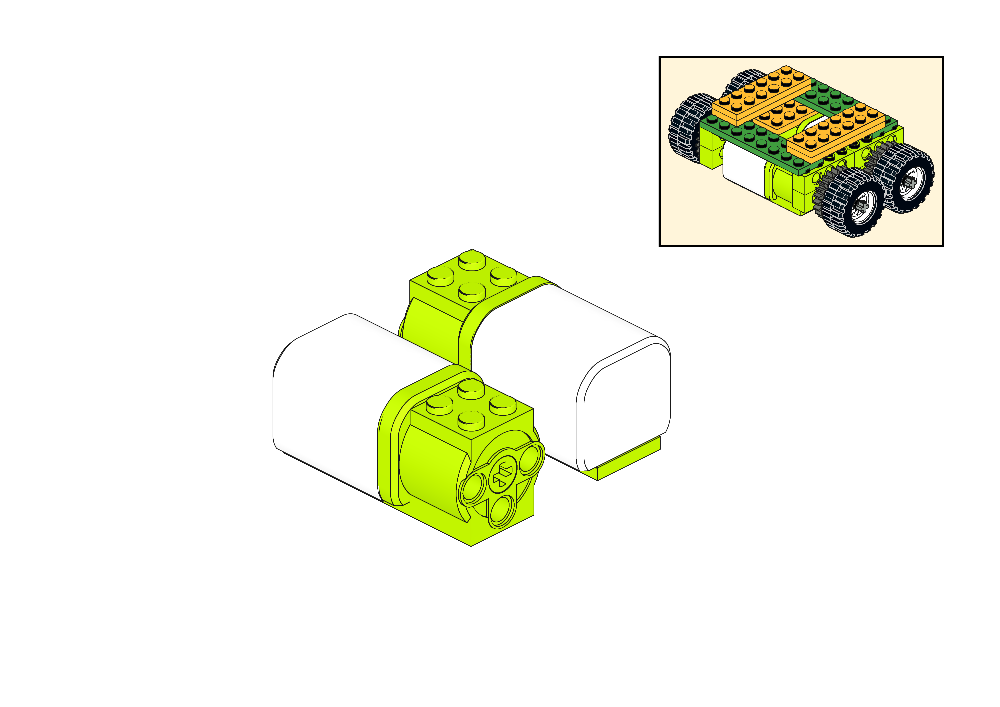 |  |  |
| :---: | :---: | :---: | :---: |
| Step 1 | Step 2 | Step 3 | Step 4 |
|  |  |  |  |
| Step 5 | Step 6 | Step 7 | Step 8 |
| 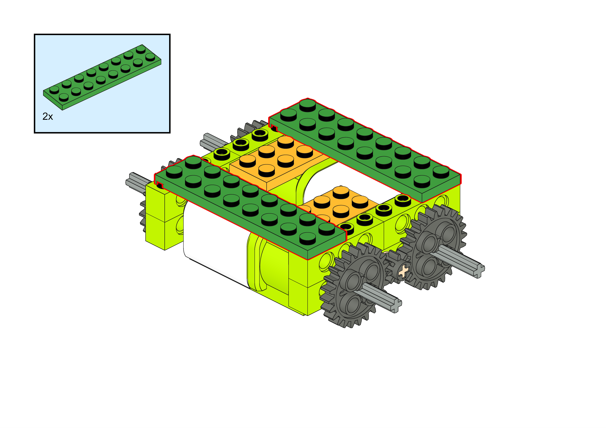 |  | 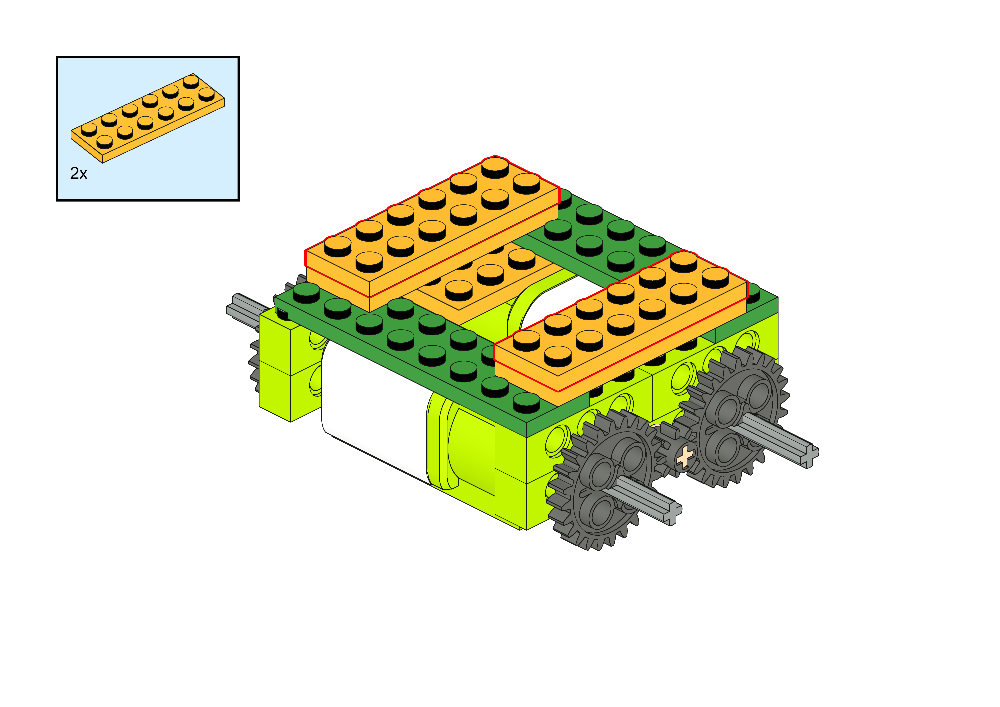 |  |
| Step 9 | Step 10 | Step 11 | Step 12 |
|  | 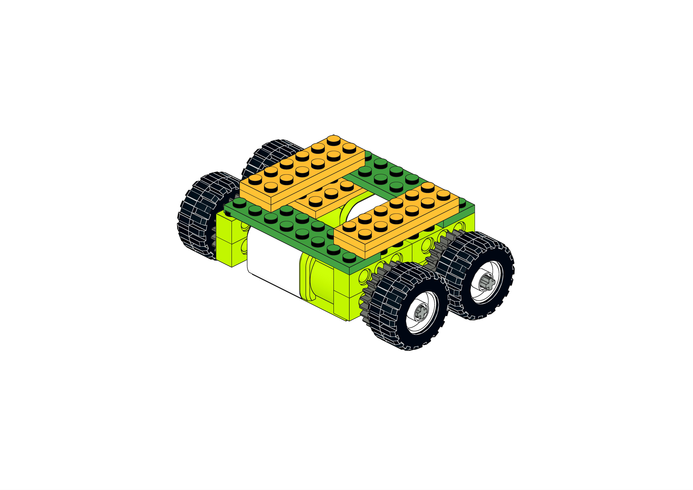 | 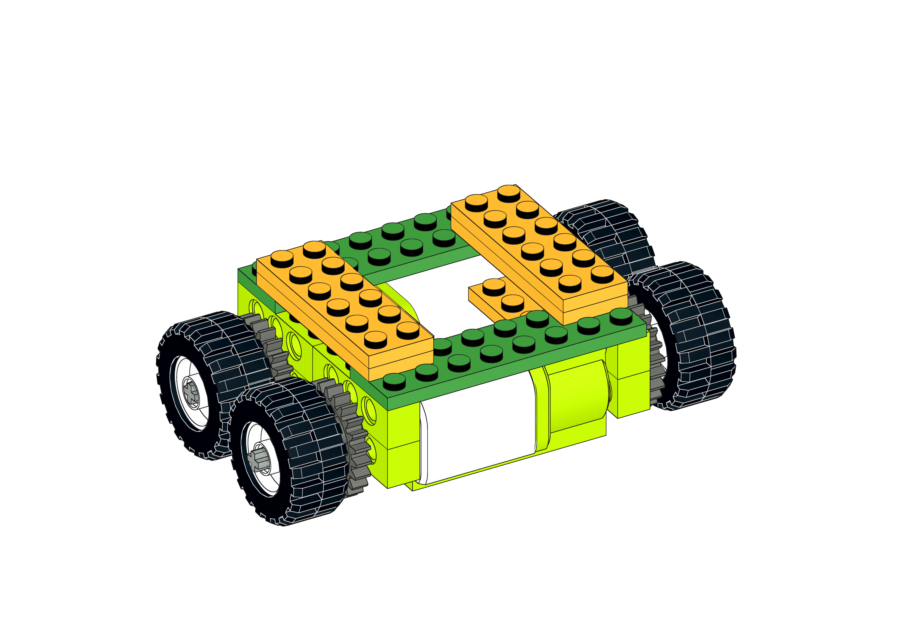 | 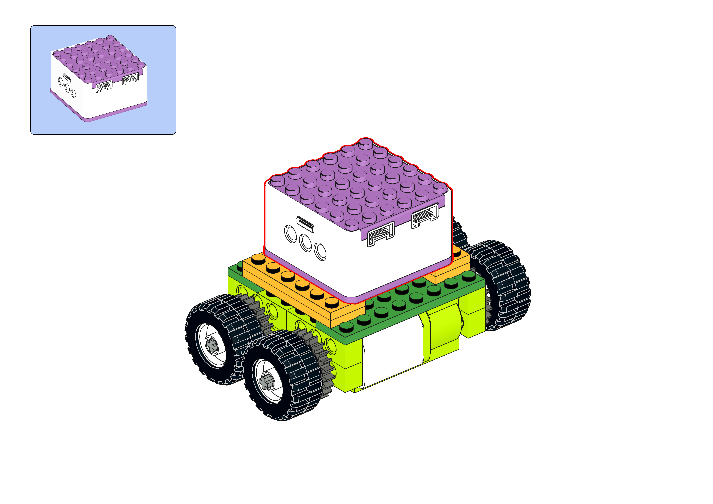 |
| Step 13 | Step 14 | Step 15 | Step 16 |
| 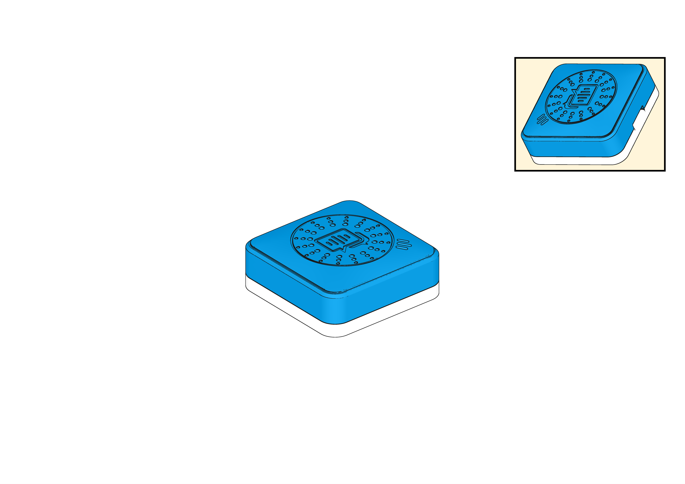 | 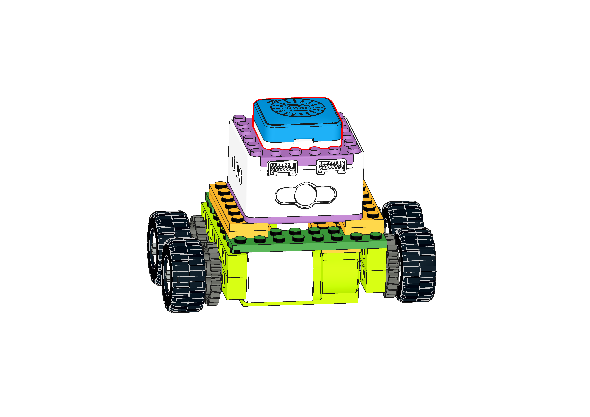 |  |  |
| Step 17 | Step 18 |  |  |

2. Steps Display

|  |  |
| --- | --- |
| 1、Press and hold the power button for 3s to power on the Xiao Q Robot. Open the APP and  connect to Bluetooth.   | 2、Connect the motor modules to ports 1 and 2 (output ports).   |
|  | 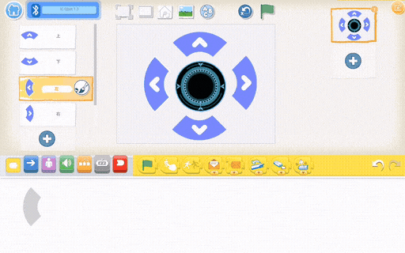 |
| 3、In the software, add four directional arrows and a stop button.   | 4、Program the up and down buttons:  Up button (Press → motor power 5 → both motors move forward);  Down button (Press → motor power 5 → both motors move backward).  Then program the left and right buttons and the stop button:  Left button (Press → motor power 5 → both motors move left → wait 2 seconds → move forward);  Right button (Press → motor power 5 → both motors move right → wait 2 seconds → move forward);  Stop button (Press → both motors stop).   |
|  |  |
| 5、Effect display. |  |

## Case 4: Voice Programming Interaction 
### Voice Programming to Control Character Movement  

### How to use voice to control the movement of a software character in all directions?  
Steps

1. Prearation

|  |  | 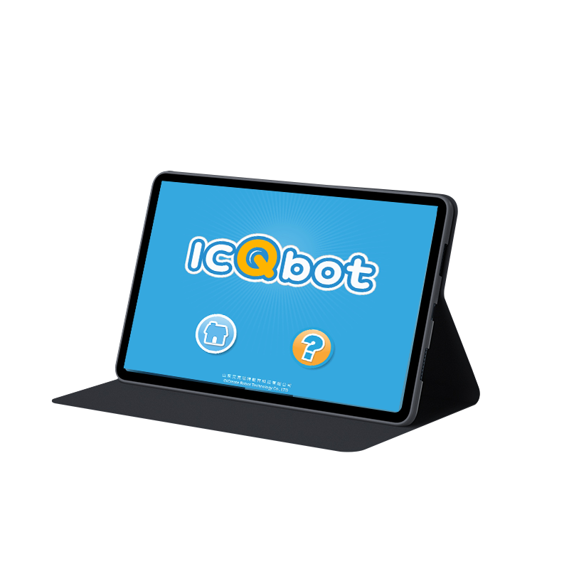 |
| :---: | :---: | :---: |
| ICQbot Xiao Q Robot × 1 | Voice Recognition Sensor ×1 | Android Tablet ×1 / iOS Tablet ×1 |

1. Steps Display

|  | 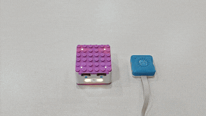 |
| --- | --- |
| 1、Press and hold the power button for 3s to power on the Xiao Q Robot.  Open the APP and connect to Bluetooth.  | 2、Connect the voice recognition sensor to port 1 or port 2 (input port).   |
| 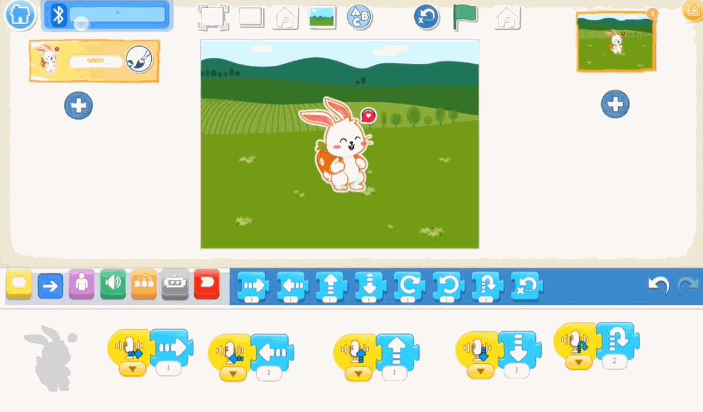 |  |
| 3、In the software, select the grassland background and the rabbit character,  then program the rabbit to move according to the voice commands.  Voice command “Up” will make the rabbit move up,  “Down” will move it down, “Left” will make it move left, and “Right” will make it move right.  The voice command “Go home” will return the character to the starting position.   More voice command words can be found in the [Voice Command List](https://icreaterobot-icqbot-docs.readthedocs.io/en/latest/docs/ICQbot/04Featureoverview/03VoiceProgrammingMode.html).   | 4、Effect display. |

