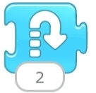
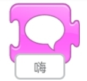
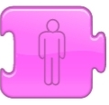
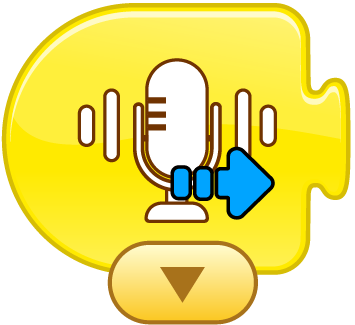

# Block Command Guide

##  Introduction

### Trigger Blocks  

| No.   | Name |  Description   | |
| :---: | :---: | :---: | --- |
| ① |  Start When Green Flag is Clicked   |  |  Place this block at the beginning of the program. When the green flag is clicked, the following program will execute.   |
| ② |  Start When Character is Clicked   |  | Place this block at the beginning of the program. When the character is clicked, the following program will execute.   |
| ③ |  Start When Colliding with Another Character   |  | Place this block at the beginning of the program. When the character collides with another character, the following program will execute.   |
| ④ | Start When Message is Received   |  | Executes the following program when a message of a specified color is received.   |
| ⑤ |  Send Message   |  | Sends a message of a specified color.   |
| ⑥ |  Start When Tilt Sensor Changes   |  | Place this block at the beginning of the program. When the tilt sensor detects a change, the following program will execute.   |
| ⑦ | Start When Distance Sensor Changes   |  | Place this block at the beginning of the program. When the distance sensor detects a state change, the following program will execute.   |
| ⑧ | Start When Button is Pressed   |  | Place this block at the beginning of the program. When the button is pressed, the following program will execute.   |

### Action Blocks  

| No.   | Name |  Description   | |
| :---: | :---: | :---: | --- |
| ① |  Move Right   |  | Moves the character to the right. The number of steps can be specified.   |
| ② |  Move Left   |  | Moves the character to the left. The number of steps can be specified.   |
| ③ |  Move Up   |  | Moves the character upwards. The number of steps can be specified.   |
| ④ |  Move Down   |  | Moves the character downwards. The number of steps can be specified.   |
| ⑤ |  Turn Right   |  | Rotates the character clockwise by a specified number of units (1-12, like a clock's hour hand; 12 represents a full circle).   |
| ⑥ |  Turn Left   |  | Rotates the character counterclockwise by a specified number of units (1-12, like a clock's hour hand; 12 represents a full circle).   |
| ⑦ |  Jump   |  | Makes the character jump. The height of the jump can be specified.   |
| ⑧ |  Go Home   |  | After moving, this block returns the character to its original position. (Drag the character to set its initial position.)   |

### Appearance Blocks  

| No.   | Name |  Description   | |
| :---: | :---: | :---: | --- |
| ① |  Speak   |  | Displays a speech bubble above the character with specified content.   |
| ② |  Enlarge   |  | Increases the character's size, making it appear larger.   |
| ③ |  Shrink   |  | Decreases the character's size, making it appear smaller.   |
| ④ |  Reset Size   |  | Resets the character's size to its original dimensions.   |
| ⑤ |  Hide   |  | Gradually makes the character disappear from the screen.   |
| ⑥ |  Show   |  | Gradually makes a hidden character reappear on the screen.   |
| ⑦ | LED  Light   |  | Changes the color of the LED light on the main controller.   |

### Sound Effect Blocks   

| No.   | Name |  Description   | |
| :---: | :---: | --- | --- |
| ① |  Start When Voice Recognition Module Recognizes   |  | Place this block at the beginning of the program. When the voice recognition module detects a command, the following program will execute.   |
| ② | Dog |  | Plays animal sounds.   |
| ③ | Car |  |  Plays car horn sounds.   |
| ④ |  Notification  |  | Plays a notification sound.   |
| ⑤ |  Pop   |  |  Plays a pop sound effect.   |

### Control Blocks  

| No.   | Name |  Description   | |
| :---: | :---: | :---: | --- |
| ① | Pause   |  | Pauses the character for a specified duration (unit: 1/10 second).   |
| ② | Stop   |  | Stops all programs running on the character.   |
| ③ | Set Speed   |  | Changes the movement speed of the character.   |
| ④ |  Loop   |  | Repeats all programs within the block for a specified number of times.   |

### Motor Blocks  

| No.   | Name |  Description   | |
| :---: | :---: | :---: | --- |
| ① |  Set Click Speed   |  | Adjusts the speed of the clicking motion (range: 0-9).   |
| ② |  Motor Port 1   |  | Controls the motor connected to Port 1.   |
| ③ |  Motor Port 2 |  | Controls the motor connected to Port 2.   |
| ④ |  Move Forward   |  | Controls the robot to move forward when two motors are connected.   |
| ⑤ |  Move Backward   |  | Controls the robot to move backward when two motors are connected.   |
| ⑥ |  Turn Left   |  | Controls the robot to turn left when two motors are connected.   |
| ⑦ |  Turn Right   |  | Controls the robot to turn right when two motors are connected.   |
| ⑧ |  Stop   |  | Stops the robot when two motors are connected.   |

### Ending Blocks  

| No.   | Name |  Description   | |
| :---: | :---: | :---: | --- |
| ① | End   |  | Indicates the end of the program (does not affect execution).   |
| ② | Infinite Loop   |  | Continuously repeats all programs within the block.   |
| ③ | Switch to Page   |  | Switches to a specified page in the project. |

