# User Guide for App

## How to Connect Bluetooth  

Steps:  

| 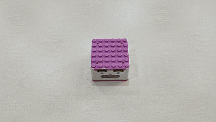 |  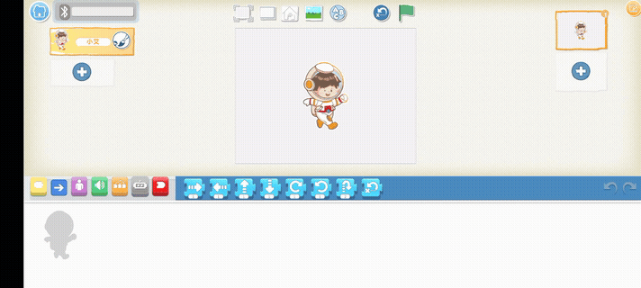 | 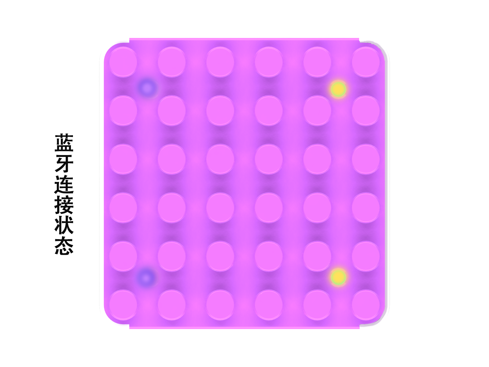 |
| --- | --- | --- |
| 1. Press and hold the power button for 3s.   | 2. Tap the gray Bluetooth icon in the top-left corner, then select the Xiao Q Robot’s Bluetooth name. Once the icon turns blue and you hear a “beep,� the connection is successful.   | 3. The input port on the ICQbot Xiao Q Robot will glow purple, and the output port will glow yellow.   |

## Renaming Bluetooth  
Steps:  

| 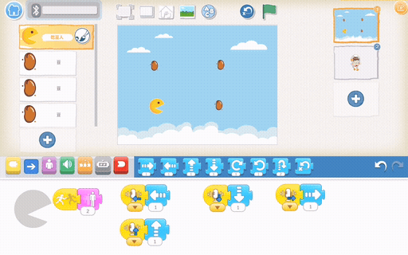 | 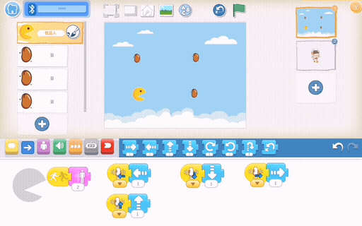 |
| --- | --- |
| 1、Connect to Bluetooth: Follow the steps above to establish a connection.   | 2、Click the blank area between the top 'Add Text' and 'Reset Role' more than 10 times until the name modification dialog box appears |
| 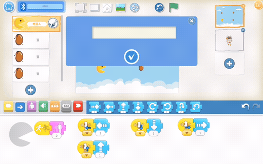 |  |
| 3、Input a new Bluetooth name in the pop-up window and confirm with the checkmark.   | 4、Reconnect to the renamed Bluetooth device.   |

## How to Use the Console  
Steps:  

| 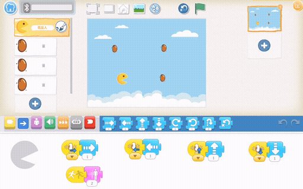 | 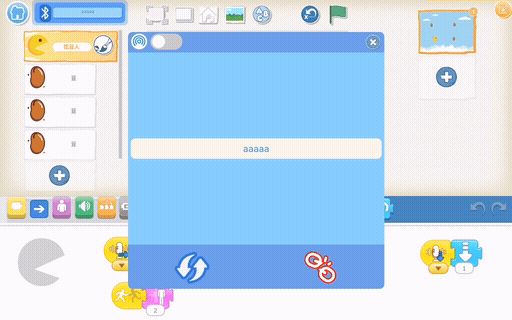 |
| --- | --- |
| 1、Connect to Bluetooth: Follow the steps above to establish a connection.   | 2、Open the console: Tap the console button at the top of the app.   |
| 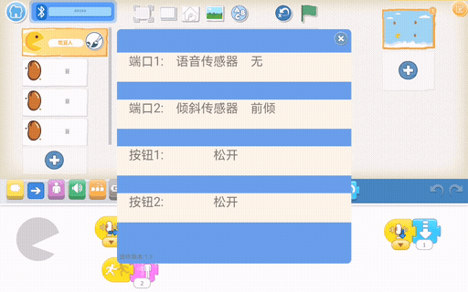 | 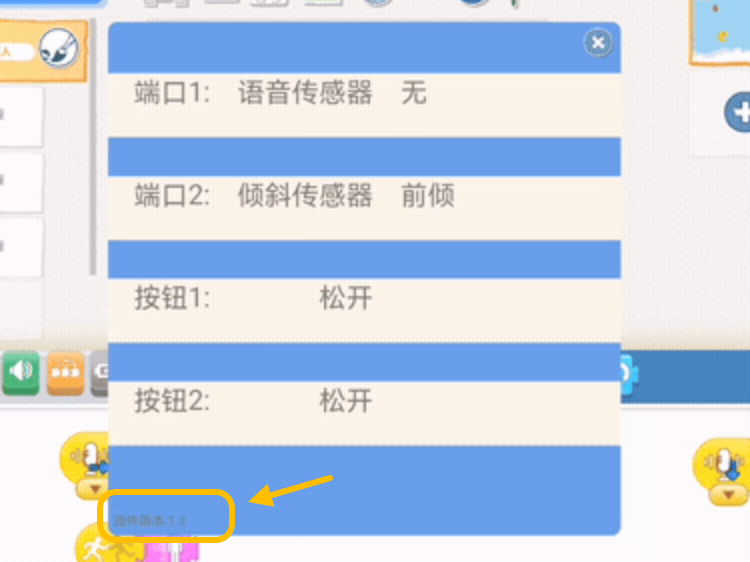 |
| 3、The pop-up window displays the status of two input ports and two buttons on the controller in real time.   | 4、The firmware version is displayed in the bottom-left corner of the pop-up.   |

## Case Study  
Using Xiao Q Robot Buttons to Move Characters  

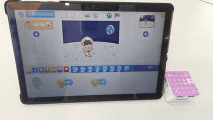

How to control the software character movement with the buttons on the  Xiao Q Robot? 

1. Preparation

| 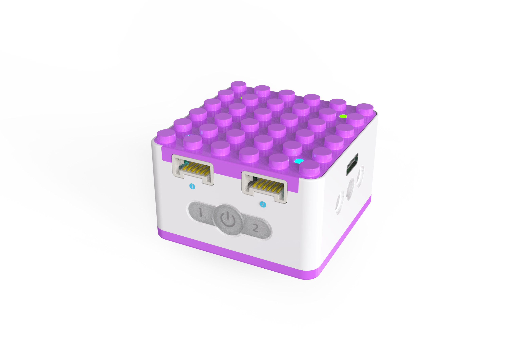 |  |
| :---: | :---: |
| ICQbot Xiao Q Robot × 1 |  Android Tablet ×1 / iOS Tablet ×1   |

2. Steps:  

|  | 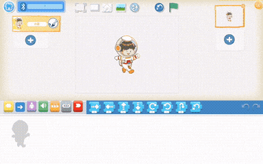 |
| --- | --- |
| 1、Turn on the Xiao Q Robot by holding the power button for 3s. Open the app, and connect via Bluetooth.   | 2、Choose a lunar background and select the “Xiao Ai� character. Program Button 1 to move the character left by 1 step and Button 2 to move it right by 1 step.   |
|  | |
| 3、Start and test the program to see the character move left and right with Button 1 and Button 2, respectively.   | |

Tap [“Learn More”](https://www.yuque.com/crystal-vzc6k/cfl3ix/fsh4h1li9d3g0kcr?singleDoc#%20《Programming%20Control%20Mode�) for additional case studies.

